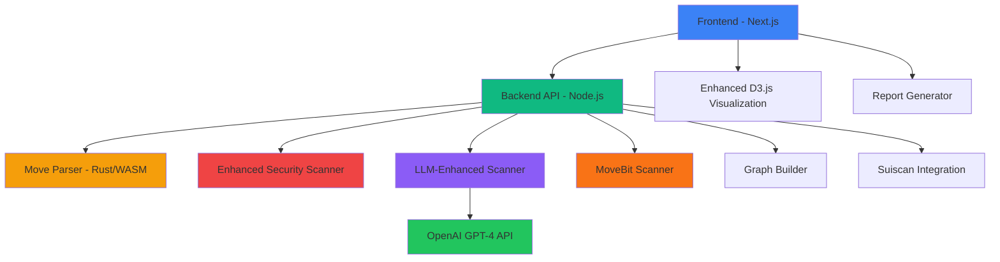
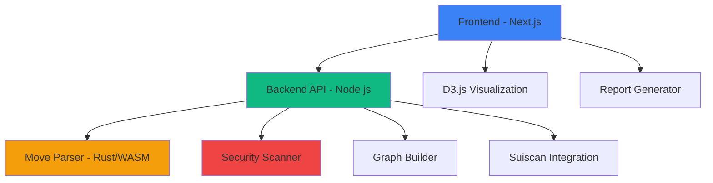

# 🔍 SuiGraph - Advanced Smart Contract Security Analyzer

<div align="center">


**Professional-grade security analysis and visualization tool for Sui blockchain smart contracts**

[](https://opensource.org/licenses/MIT)
[](https://nextjs.org/)
[](https://www.typescriptlang.org/)
[](https://tailwindcss.com/)

</div>

---

## 🌟 **Overview**

SuiGraph is a cutting-edge, full-stack application designed to revolutionize smart contract security analysis on the Sui blockchain. It combines advanced static analysis, interactive dependency visualization, and comprehensive security reporting to provide developers and auditors with unprecedented insights into Move smart contract architecture and vulnerabilities.

### ✨ **Key Features**

<table>
<tr>
<td width="50%">

**🔒 Advanced Security Analysis**
- 15+ vulnerability detection patterns
- AI-powered LLM analysis with GPT-4
- MoveBit methodology integration
- Static AST + dynamic analysis engine
- Severity-based risk categorization
- Function-level security assessment

**📊 Interactive Visualization**
- Real-time dependency graphs
- D3.js-powered visualizations
- Module and function mapping
- Clickable node interactions

</td>
<td width="50%">

**🌐 Multi-Input Support**
- File upload (drag & drop)
- Suiscan URL integration
- Object ID analysis
- Package address scanning

**📄 Comprehensive Reporting**
- PDF export functionality
- Markdown documentation
- JSON data export
- Executive summaries

</td>
</tr>
</table>

---

## 🏗️ **Architecture**

SuiGraph follows a modern, scalable architecture designed for performance and maintainability:



### 📁 **Project Structure**

```
suigraph/
├── 🎨 frontend/                 # Next.js React Application
│   ├── src/
│   │   ├── app/                 # App Router Pages
│   │   ├── components/          # Reusable UI Components
│   │   │   ├── GraphViewer.tsx          # D3.js Graph Visualization
│   │   │   ├── EnhancedGraphViewer.tsx  # Advanced Graph with AI Features
│   │   │   ├── VulnerabilityPanel.tsx   # Security Report UI
│   │   │   ├── ReportExporter.tsx       # PDF/Markdown Export
│   │   │   ├── UploadForm.tsx           # File Upload Interface
│   │   │   └── SuiscanInput.tsx         # Suiscan Integration UI
│   │   ├── contexts/            # React Context Providers
│   │   └── utils/               # API Utilities
│   └── public/                  # Static Assets
├── ⚙️  backend/                  # Node.js Express API
│   ├── src/
│   │   ├── routes/              # API Endpoints
│   │   │   ├── upload.js            # File Upload Handler
│   │   │   ├── analyze.js           # Analysis Engine
│   │   │   └── fetchContract.js     # Suiscan Integration
│   │   ├── services/            # Business Logic
│   │   │   ├── graphBuilder.js              # Dependency Graph Generation
│   │   │   ├── securityScanner.js           # Core Vulnerability Detection
│   │   │   ├── enhancedSecurityScanner.js   # Advanced AST Analysis
│   │   │   ├── llmEnhancedSecurityScanner.js # AI-Powered Analysis
│   │   │   ├── moveBitEnhancedScanner.js    # MoveBit Methodology Scanner
│   │   │   └── suiscanFetcher.js            # On-chain Data Retrieval
│   │   └── parsers/             # Move Code Parsing
│   └── uploads/                 # Temporary File Storage
├── 🦀 parsers/                  # Rust WASM Parser (Future)
├── 📚 docs/                     # Documentation & Examples
└── 🧪 tests/                    # Test Suites
```

---

## 🚀 **Quick Start**

### Prerequisites

- **Node.js** 18.0.0 or later
- **npm** 9.0.0 or later
- **Git** for version control

### 🔧 **Installation**

1. **Clone the Repository**
   ```bash
   git clone https://github.com/tgcohce/suigraph.git
   cd suigraph
   ```

2. **Backend Setup**
   ```bash
   cd backend
   npm install
   cp .env.example .env
   # Add your OpenAI API key to .env for AI-powered analysis
   npm run dev
   ```
   🌐 Backend will be available at `http://localhost:3001`
   
   💡 **Note**: AI-powered analysis requires an OpenAI API key. The system will gracefully fallback to static analysis if not configured.

3. **Frontend Setup**
   ```bash
   cd frontend
   npm install
   cp .env.local.example .env.local
   npm run dev
   ```
   🌐 Frontend will be available at `http://localhost:3000`

### ⚡ **Quick Test**

1. Open your browser to `http://localhost:3000`
2. Upload a `.move` file or paste a Suiscan URL
3. View the generated dependency graph and security report
4. Export your analysis as PDF or Markdown

---

## 💻 **User Interface**

### 🎨 **Modern Design System**

SuiGraph features a beautiful, accessible interface with:

- **🌙 Dark/Light Mode**: Seamless theme switching
- **📱 Responsive Design**: Works on desktop, tablet, and mobile
- **✨ Smooth Animations**: Polished interactions and transitions
- **🎯 Intuitive Navigation**: Clear information hierarchy

### 🖥️ **Dashboard Overview**[README.md](README.md)

<table>
<tr>
<td width="30%">

**Input Panel**
- File upload with drag & drop
- Suiscan URL input
- Real-time validation
- Progress indicators

</td>
<td width="40%">

**Main Visualization**
- Interactive dependency graph
- Clickable nodes with details
- Zoom and pan capabilities
- Vulnerability highlighting

</td>
<td width="30%">

**Analysis Results**
- Security metrics overview
- Severity breakdown
- Module/function counts
- Export options

</td>
</tr>
</table>

---

## 🔐 **Security Analysis Engine**

### 🛡️ **Multi-Layer Vulnerability Detection**

SuiGraph's advanced security analysis combines multiple detection engines:

#### **🤖 AI-Powered Analysis (GPT-4)**
- Contextual vulnerability detection
- Smart contract best practice validation
- Custom vulnerability pattern recognition
- Natural language explanations of findings

#### **🔍 MoveBit Methodology Integration**
- Professional audit-grade detection rules
- Race condition analysis
- Temporal logic vulnerabilities
- Integer overflow/underflow detection
- Access control validation

#### **📊 Static AST Analysis**
Core vulnerability patterns detected:

| Severity | Vulnerability Type | Detection Method | Description |
|----------|-------------------|------------------|-------------|
| 🔴 **Critical** | Unchecked Coin Transfers | AST + AI | Coin operations without proper validation |
| 🔴 **Critical** | Cetus-style DeFi Vulnerabilities | AST + MoveBit | Public functions transferring coins without access control |
| 🔴 **High** | Unrestricted Public Entry Functions | AST + AI | Public entry points without proper access controls |
| 🔴 **High** | Authority Misuse | AST + AI | Capability usage without proper checks |
| 🔴 **High** | Missing Access Guards | AST + MoveBit | Missing has_access or assert_owner checks |
| 🟡 **Medium** | Transaction-Ordering Dependence | MoveBit + AI | Race condition vulnerabilities |
| 🟡 **Medium** | Timestamp Dependence | MoveBit + AI | Temporal logic vulnerabilities |
| 🟡 **Medium** | Mutable Shared Objects | AST + AI | Risky shared object access patterns |
| 🟡 **Medium** | Integer Overflow/Underflow | MoveBit + AI | Arithmetic operation vulnerabilities |
| 🔵 **Low** | Missing Abort Conditions | AST | Functions lacking proper error handling |

### 📊 **Analysis Capabilities**

- **Multi-Engine Analysis**: Combines AST, AI, and MoveBit methodologies
- **Static Code Analysis**: Comprehensive Move code parsing and AST traversal
- **AI-Enhanced Detection**: GPT-4 powered contextual vulnerability analysis
- **Professional Audit Standards**: MoveBit methodology integration
- **Dependency Mapping**: Module and function relationship tracking
- **Pattern Recognition**: Heuristic + AI-based vulnerability detection
- **Confidence Scoring**: Reliability indicators for findings
- **Context Analysis**: Code environment and usage pattern evaluation
- **Taint Propagation**: Advanced data flow analysis
- **Simulation-Based Testing**: Virtual execution environment analysis

---

## 🌐 **Suiscan Integration**

### 🔗 **Supported Input Formats**

SuiGraph seamlessly integrates with Suiscan to analyze deployed contracts:

```typescript
// Supported URL formats
"https://suiscan.xyz/mainnet/object/0x..."     // Suiscan Object URL
"https://suivision.xyz/testnet/object/0x..."   // Suivision URL
"0x1234...abcd"                                // Direct Object ID (66 chars)
"0x5678...efgh"                                // Package Address (64 chars)
```

### ⚙️ **Network Support**

- ✅ **Mainnet**: Production contracts
- ✅ **Testnet**: Development contracts  
- ✅ **Devnet**: Experimental contracts

---

## 📈 **Visualization Features**

### 🎯 **Interactive Dependency Graph**

Built with D3.js for smooth, responsive interactions:

- **Node Types**: Modules, Functions, Imports
- **Relationship Mapping**: Call dependencies and containment
- **Visual Indicators**: Security status and severity levels
- **Interactive Elements**: Click, drag, zoom, and pan
- **Real-time Updates**: Dynamic graph generation

### 🎨 **Visual Design Elements**

- **Color-coded Nodes**: Different types and security states
- **Animated Transitions**: Smooth state changes
- **Responsive Layout**: Adapts to screen size
- **Accessibility**: Keyboard navigation and screen reader support

---

## 📄 **Report Generation**

### 📝 **Export Formats**

SuiGraph generates comprehensive reports in multiple formats:

#### **PDF Reports**
- Executive summary with key metrics
- Detailed vulnerability listings
- Visual graph representations
- Professional formatting

#### **Markdown Documentation**
- GitHub-compatible formatting
- Code syntax highlighting
- Structured vulnerability details
- Easy integration with documentation

#### **JSON Data Export**
- Complete analysis results
- Machine-readable format
- API integration ready
- Custom processing support

### 📋 **Report Contents**

Each report includes:

1. **Executive Summary**
   - Overall security assessment
   - Key metrics and statistics
   - Risk level determination

2. **Detailed Findings**
   - Vulnerability descriptions
   - Code context and locations
   - Remediation recommendations
   - Confidence assessments

3. **Technical Analysis**
   - Module structure overview
   - Function dependency mapping
   - Import analysis
   - Architecture insights

---

## 🔧 **API Reference**

### 🌐 **Backend Endpoints**

#### **Health Check**
```http
GET /status
```
Returns system status and uptime information.

#### **File Upload**
```http
POST /upload
Content-Type: multipart/form-data

{
  "files": [File, File, ...]
}
```

#### **Contract Analysis**
```http
POST /analyze
Content-Type: application/json

{
  "fileIds": ["uuid1", "uuid2", ...],
  "code": "module example::token { ... }",
  "fileName": "token.move"
}
```

#### **Suiscan Integration**
```http
POST /fetchContract
Content-Type: application/json

{
  "input": "https://suiscan.xyz/mainnet/object/0x...",
  "type": "url" | "object" | "package"
}
```

### 📊 **Response Format**

```typescript
interface AnalysisResponse {
  files: FileInfo[];
  modules: ModuleInfo[];
  functions: FunctionInfo[];
  nodes: GraphNode[];
  links: GraphLink[];
  vulnerabilities: Vulnerability[];
  metadata: AnalysisMetadata;
}
```

---

## 🧪 **Development & Testing**

### 🛠️ **Development Commands**

```bash
# Frontend Development
cd frontend
npm run dev          # Start development server
npm run build        # Build for production
npm run lint         # Run ESLint
npm run type-check   # TypeScript validation

# Backend Development  
cd backend
npm run dev          # Start with nodemon
npm run start        # Production start
npm test             # Run test suite
```

### 🧩 **Testing Strategy**

- **Unit Tests**: Component and service testing
- **Integration Tests**: API endpoint validation
- **E2E Tests**: Full user workflow testing
- **Security Tests**: Vulnerability detection accuracy

### 🔍 **Debugging Tools**

- **Console Logging**: Comprehensive debug output
- **Error Boundaries**: Graceful error handling
- **Performance Monitoring**: React DevTools integration
- **Network Analysis**: API request/response tracking

---

## 🚢 **Deployment**

### ☁️ **Production Deployment**

#### **Frontend (Vercel)**
```bash
# Automatic deployment
git push origin main

# Manual deployment
npm run build
vercel --prod
```

#### **Backend (Fly.io)**
```bash
# Setup
fly auth login
fly launch

# Deploy
fly deploy
```

### 🔧 **Environment Configuration**

#### **Frontend (.env.local)**
```env
NEXT_PUBLIC_API_URL=https://api.suigraph.com
NEXT_PUBLIC_ENABLE_ANALYTICS=true
```

#### **Backend (.env)**
```env
NODE_ENV=production
PORT=3001
SUI_RPC_URL=https://fullnode.mainnet.sui.io:443
CORS_ORIGIN=https://suigraph.com
OPENAI_API_KEY=your_openai_api_key_here
```

---

## 🎯 **Roadmap**

### 🔮 **Current Phase (v1.2)**
- ✅ Core analysis engine
- ✅ Modern UI with dark mode
- ✅ PDF/Markdown export
- ✅ Suiscan integration
- ✅ AI-powered analysis with GPT-4
- ✅ MoveBit methodology integration
- ✅ Enhanced AST analysis
- ✅ Multi-layer vulnerability detection

### 🚀 **Next Phase (v1.3)**
- [ ] Enhanced WASM parser
- [ ] Advanced ML vulnerability rules
- [ ] GitHub integration
- [ ] Team collaboration features
- [ ] Custom AI model training
- [ ] Batch analysis workflows

### 🌟 **Future Vision (v2.0)**
- [ ] Multi-chain support (Ethereum, Aptos)
- [ ] Real-time monitoring
- [ ] IDE integrations
- [ ] Automated fix suggestions
- [ ] Community vulnerability database

---

## 🤝 **Contributing**

We welcome contributions from the community! Here's how to get involved:

### 📋 **Development Setup**

1. **Fork the repository**
2. **Create a feature branch**: `git checkout -b feature/amazing-feature`
3. **Make your changes** with comprehensive tests
4. **Follow the coding standards** (ESLint, Prettier)
5. **Submit a pull request** with detailed description

### 🎨 **Code Standards**

- **TypeScript**: Strict typing required
- **Component Structure**: Functional components with hooks
- **Styling**: Tailwind CSS with design system
- **Testing**: Jest and React Testing Library
- **Documentation**: JSDoc comments for complex functions

### 🐛 **Bug Reports**

Found a bug? Please create an issue with:
- Detailed reproduction steps
- Expected vs actual behavior
- Environment information
- Screenshots if applicable

---

## 📚 **Resources**

### 🔗 **Useful Links**

- [Sui Developer Documentation](https://docs.sui.io/)
- [Move Language Guide](https://move-language.github.io/move/)
- [Suiscan Explorer](https://suiscan.xyz/)
- [D3.js Documentation](https://d3js.org/)

### 📖 **Learning Materials**

- [Move Security Best Practices](https://docs.sui.io/guides/developer/sui-101/move-intro)
- [Smart Contract Audit Techniques](https://github.com/securing/SCSVS)
- [Graph Visualization Principles](https://observablehq.com/@d3/gallery)

---

## 🏆 **Acknowledgments**

Special thanks to:

- **Sui Foundation** for the innovative blockchain platform
- **Move Language Team** for the secure programming language
- **D3.js Community** for powerful visualization tools
- **Open Source Contributors** who make projects like this possible

---

## 📄 **License**

This project is licensed under the MIT License - see the [LICENSE](LICENSE) file for details.

```
MIT License

Copyright (c) 2024 SuiGraph Team

Permission is hereby granted, free of charge, to any person obtaining a copy
of this software and associated documentation files (the "Software"), to deal
in the Software without restriction, including without limitation the rights
to use, copy, modify, merge, publish, distribute, sublicense, and/or sell
copies of the Software, and to permit persons to whom the Software is
furnished to do so, subject to the following conditions:

The above copyright notice and this permission notice shall be included in all
copies or substantial portions of the Software.
```

---

<div align="center">

**🔍 Built with ❤️ for the Sui ecosystem**

[Website](https://suigraph.com) • [Documentation](https://docs.suigraph.com) • [Discord](https://discord.gg/suigraph) • [Twitter](https://twitter.com/suigraph)

</div>
[](https://opensource.org/licenses/MIT)
[](https://nextjs.org/)
[](https://www.typescriptlang.org/)
[](https://tailwindcss.com/)

</div>

---

## 🌟 **Overview**

SuiGraph is a cutting-edge, full-stack application designed to revolutionize smart contract security analysis on the Sui blockchain. It combines advanced static analysis, interactive dependency visualization, and comprehensive security reporting to provide developers and auditors with unprecedented insights into Move smart contract architecture and vulnerabilities.

### ✨ **Key Features**

<table>
<tr>
<td width="50%">

**🔒 Advanced Security Analysis**
- 8+ vulnerability detection patterns
- Static code analysis engine
- Severity-based risk categorization
- Function-level security assessment

**📊 Interactive Visualization**
- Real-time dependency graphs
- D3.js-powered visualizations
- Module and function mapping
- Clickable node interactions

</td>
<td width="50%">

**🌐 Multi-Input Support**
- File upload (drag & drop)
- Suiscan URL integration
- Object ID analysis
- Package address scanning

**📄 Comprehensive Reporting**
- PDF export functionality
- Markdown documentation
- JSON data export
- Executive summaries

</td>
</tr>
</table>

---

## 🏗️ **Architecture**

SuiGraph follows a modern, scalable architecture designed for performance and maintainability:



### 📁 **Project Structure**

```
suigraph/
├── 🎨 frontend/                 # Next.js React Application
│   ├── src/
│   │   ├── app/                 # App Router Pages
│   │   ├── components/          # Reusable UI Components
│   │   │   ├── GraphViewer.tsx      # D3.js Graph Visualization
│   │   │   ├── VulnerabilityPanel.tsx # Security Report UI
│   │   │   ├── ReportExporter.tsx    # PDF/Markdown Export
│   │   │   ├── UploadForm.tsx        # File Upload Interface
│   │   │   └── SuiscanInput.tsx      # Suiscan Integration UI
│   │   ├── contexts/            # React Context Providers
│   │   └── utils/               # API Utilities
│   └── public/                  # Static Assets
├── ⚙️  backend/                  # Node.js Express API
│   ├── src/
│   │   ├── routes/              # API Endpoints
│   │   │   ├── upload.js            # File Upload Handler
│   │   │   ├── analyze.js           # Analysis Engine
│   │   │   └── fetchContract.js     # Suiscan Integration
│   │   ├── services/            # Business Logic
│   │   │   ├── graphBuilder.js      # Dependency Graph Generation
│   │   │   ├── securityScanner.js   # Vulnerability Detection
│   │   │   └── suiscanFetcher.js    # On-chain Data Retrieval
│   │   └── parsers/             # Move Code Parsing
│   └── uploads/                 # Temporary File Storage
├── 🦀 parsers/                  # Rust WASM Parser (Future)
├── 📚 docs/                     # Documentation & Examples
└── 🧪 tests/                    # Test Suites
```

---

## 🚀 **Quick Start**

### Prerequisites

- **Node.js** 18.0.0 or later
- **npm** 9.0.0 or later
- **Git** for version control

### 🔧 **Installation**

1. **Clone the Repository**
   ```bash
   git clone https://github.com/tgcohce/suigraph.git
   cd suigraph
   ```

2. **Backend Setup**
   ```bash
   cd backend
   npm install
   cp .env.example .env
   npm run dev
   ```
   🌐 Backend will be available at `http://localhost:3001`

3. **Frontend Setup**
   ```bash
   cd frontend
   npm install
   cp .env.local.example .env.local
   npm run dev
   ```
   🌐 Frontend will be available at `http://localhost:3000`

### ⚡ **Quick Test**

1. Open your browser to `http://localhost:3000`
2. Upload a `.move` file or paste a Suiscan URL
3. View the generated dependency graph and security report
4. Export your analysis as PDF or Markdown

---

## 💻 **User Interface**

### 🎨 **Modern Design System**

SuiGraph features a beautiful, accessible interface with:

- **🌙 Dark/Light Mode**: Seamless theme switching
- **📱 Responsive Design**: Works on desktop, tablet, and mobile
- **✨ Smooth Animations**: Polished interactions and transitions
- **🎯 Intuitive Navigation**: Clear information hierarchy

### 🖥️ **Dashboard Overview**

<table>
<tr>
<td width="30%">

**Input Panel**
- File upload with drag & drop
- Suiscan URL input
- Real-time validation
- Progress indicators

</td>
<td width="40%">

**Main Visualization**
- Interactive dependency graph
- Clickable nodes with details
- Zoom and pan capabilities
- Vulnerability highlighting

</td>
<td width="30%">

**Analysis Results**
- Security metrics overview
- Severity breakdown
- Module/function counts
- Export options

</td>
</tr>
</table>

---

## 🔐 **Security Analysis Engine**

### 🛡️ **Vulnerability Detection**

SuiGraph's advanced security scanner identifies critical vulnerabilities:

| Severity | Vulnerability Type | Description |
|----------|-------------------|-------------|
| 🔴 **High** | Unrestricted Public Entry Functions | Public entry points without proper access controls |
| 🔴 **High** | Unchecked Coin Transfers | Coin operations without validation |
| 🔴 **High** | Authority Misuse | Capability usage without proper checks |
| 🟡 **Medium** | Mutable Shared Objects | Risky shared object access patterns |
| 🟡 **Medium** | Unsafe Type Casting | Potentially dangerous type operations |
| 🔵 **Low** | Missing Abort Conditions | Functions lacking proper error handling |

### 📊 **Analysis Capabilities**

- **Static Code Analysis**: Comprehensive Move code parsing
- **Dependency Mapping**: Module and function relationship tracking
- **Pattern Recognition**: Heuristic-based vulnerability detection
- **Confidence Scoring**: Reliability indicators for findings
- **Context Analysis**: Code environment and usage pattern evaluation

---

## 🌐 **Suiscan Integration**

### 🔗 **Supported Input Formats**

SuiGraph seamlessly integrates with Suiscan to analyze deployed contracts:

```typescript
// Supported URL formats
"https://suiscan.xyz/mainnet/object/0x..."     // Suiscan Object URL
"https://suivision.xyz/testnet/object/0x..."   // Suivision URL
"0x1234...abcd"                                // Direct Object ID (66 chars)
"0x5678...efgh"                                // Package Address (64 chars)
```

### ⚙️ **Network Support**

- ✅ **Mainnet**: Production contracts
- ✅ **Testnet**: Development contracts  
- ✅ **Devnet**: Experimental contracts

---

## 📈 **Visualization Features**

### 🎯 **Interactive Dependency Graph**

Built with D3.js for smooth, responsive interactions:

- **Node Types**: Modules, Functions, Imports
- **Relationship Mapping**: Call dependencies and containment
- **Visual Indicators**: Security status and severity levels
- **Interactive Elements**: Click, drag, zoom, and pan
- **Real-time Updates**: Dynamic graph generation

### 🎨 **Visual Design Elements**

- **Color-coded Nodes**: Different types and security states
- **Animated Transitions**: Smooth state changes
- **Responsive Layout**: Adapts to screen size
- **Accessibility**: Keyboard navigation and screen reader support

---

## 📄 **Report Generation**

### 📝 **Export Formats**

SuiGraph generates comprehensive reports in multiple formats:

#### **PDF Reports**
- Executive summary with key metrics
- Detailed vulnerability listings
- Visual graph representations
- Professional formatting

#### **Markdown Documentation**
- GitHub-compatible formatting
- Code syntax highlighting
- Structured vulnerability details
- Easy integration with documentation

#### **JSON Data Export**
- Complete analysis results
- Machine-readable format
- API integration ready
- Custom processing support

### 📋 **Report Contents**

Each report includes:

1. **Executive Summary**
   - Overall security assessment
   - Key metrics and statistics
   - Risk level determination

2. **Detailed Findings**
   - Vulnerability descriptions
   - Code context and locations
   - Remediation recommendations
   - Confidence assessments

3. **Technical Analysis**
   - Module structure overview
   - Function dependency mapping
   - Import analysis
   - Architecture insights

---

## 🔧 **API Reference**

### 🌐 **Backend Endpoints**

#### **Health Check**
```http
GET /status
```
Returns system status and uptime information.

#### **File Upload**
```http
POST /upload
Content-Type: multipart/form-data

{
  "files": [File, File, ...]
}
```

#### **Contract Analysis**
```http
POST /analyze
Content-Type: application/json

{
  "fileIds": ["uuid1", "uuid2", ...],
  "code": "module example::token { ... }",
  "fileName": "token.move"
}
```

#### **Suiscan Integration**
```http
POST /fetchContract
Content-Type: application/json

{
  "input": "https://suiscan.xyz/mainnet/object/0x...",
  "type": "url" | "object" | "package"
}
```

### 📊 **Response Format**

```typescript
interface AnalysisResponse {
  files: FileInfo[];
  modules: ModuleInfo[];
  functions: FunctionInfo[];
  nodes: GraphNode[];
  links: GraphLink[];
  vulnerabilities: Vulnerability[];
  metadata: AnalysisMetadata;
}
```

---

## 🧪 **Development & Testing**

### 🛠️ **Development Commands**

```bash
# Frontend Development
cd frontend
npm run dev          # Start development server
npm run build        # Build for production
npm run lint         # Run ESLint
npm run type-check   # TypeScript validation

# Backend Development  
cd backend
npm run dev          # Start with nodemon
npm run start        # Production start
npm test             # Run test suite
```

### 🧩 **Testing Strategy**

- **Unit Tests**: Component and service testing
- **Integration Tests**: API endpoint validation
- **E2E Tests**: Full user workflow testing
- **Security Tests**: Vulnerability detection accuracy

### 🔍 **Debugging Tools**

- **Console Logging**: Comprehensive debug output
- **Error Boundaries**: Graceful error handling
- **Performance Monitoring**: React DevTools integration
- **Network Analysis**: API request/response tracking

---

## 🚢 **Deployment**

### ☁️ **Production Deployment**

#### **Frontend (Vercel)**
```bash
# Automatic deployment
git push origin main

# Manual deployment
npm run build
vercel --prod
```

#### **Backend (Fly.io)**
```bash
# Setup
fly auth login
fly launch

# Deploy
fly deploy
```

### 🔧 **Environment Configuration**

#### **Frontend (.env.local)**
```env
NEXT_PUBLIC_API_URL=https://api.suigraph.com
NEXT_PUBLIC_ENABLE_ANALYTICS=true
```

#### **Backend (.env)**
```env
NODE_ENV=production
PORT=3001
SUI_RPC_URL=https://fullnode.mainnet.sui.io:443
CORS_ORIGIN=https://suigraph.com
```

---

## 🎯 **Roadmap**

### 🔮 **Current Phase (v1.0)**
- ✅ Core analysis engine
- ✅ Modern UI with dark mode
- ✅ PDF/Markdown export
- ✅ Suiscan integration

### 🚀 **Next Phase (v1.1)**
- [ ] Enhanced WASM parser
- [ ] Advanced vulnerability rules
- [ ] GitHub integration
- [ ] Team collaboration features

### 🌟 **Future Vision (v2.0)**
- [ ] AI-powered analysis
- [ ] Multi-chain support
- [ ] Real-time monitoring
- [ ] IDE integrations

---

## 🤝 **Contributing**

We welcome contributions from the community! Here's how to get involved:

### 📋 **Development Setup**

1. **Fork the repository**
2. **Create a feature branch**: `git checkout -b feature/amazing-feature`
3. **Make your changes** with comprehensive tests
4. **Follow the coding standards** (ESLint, Prettier)
5. **Submit a pull request** with detailed description

### 🎨 **Code Standards**

- **TypeScript**: Strict typing required
- **Component Structure**: Functional components with hooks
- **Styling**: Tailwind CSS with design system
- **Testing**: Jest and React Testing Library
- **Documentation**: JSDoc comments for complex functions

### 🐛 **Bug Reports**

Found a bug? Please create an issue with:
- Detailed reproduction steps
- Expected vs actual behavior
- Environment information
- Screenshots if applicable

---

## 📚 **Resources**

### 🔗 **Useful Links**

- [Sui Developer Documentation](https://docs.sui.io/)
- [Move Language Guide](https://move-language.github.io/move/)
- [Suiscan Explorer](https://suiscan.xyz/)
- [D3.js Documentation](https://d3js.org/)

### 📖 **Learning Materials**

- [Move Security Best Practices](https://docs.sui.io/guides/developer/sui-101/move-intro)
- [Smart Contract Audit Techniques](https://github.com/securing/SCSVS)
- [Graph Visualization Principles](https://observablehq.com/@d3/gallery)

---

## 🏆 **Acknowledgments**

Special thanks to:

- **Sui Foundation** for the innovative blockchain platform
- **Move Language Team** for the secure programming language
- **D3.js Community** for powerful visualization tools
- **Open Source Contributors** who make projects like this possible

---

## 📄 **License**

This project is licensed under the MIT License - see the [LICENSE](LICENSE) file for details.

```
MIT License

Copyright (c) 2024 SuiGraph Team

Permission is hereby granted, free of charge, to any person obtaining a copy
of this software and associated documentation files (the "Software"), to deal
in the Software without restriction, including without limitation the rights
to use, copy, modify, merge, publish, distribute, sublicense, and/or sell
copies of the Software, and to permit persons to whom the Software is
furnished to do so, subject to the following conditions:

The above copyright notice and this permission notice shall be included in all
copies or substantial portions of the Software.
```

---

<div align="center">

**🔍 Built with ❤️ for the Sui ecosystem**

[Website](https://suigraph.com) • [Documentation](https://docs.suigraph.com) • [Discord](https://discord.gg/suigraph) • [Twitter](https://twitter.com/suigraph)

</div>
